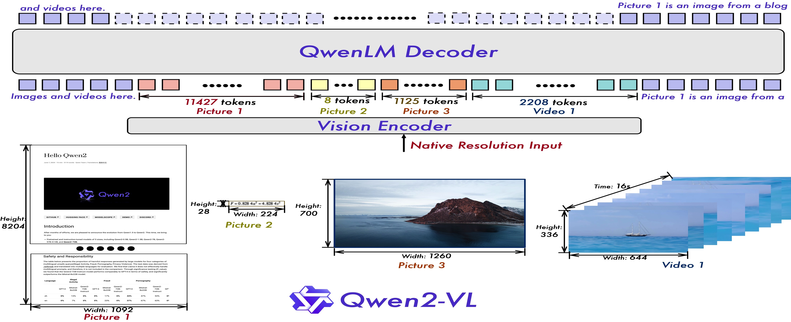
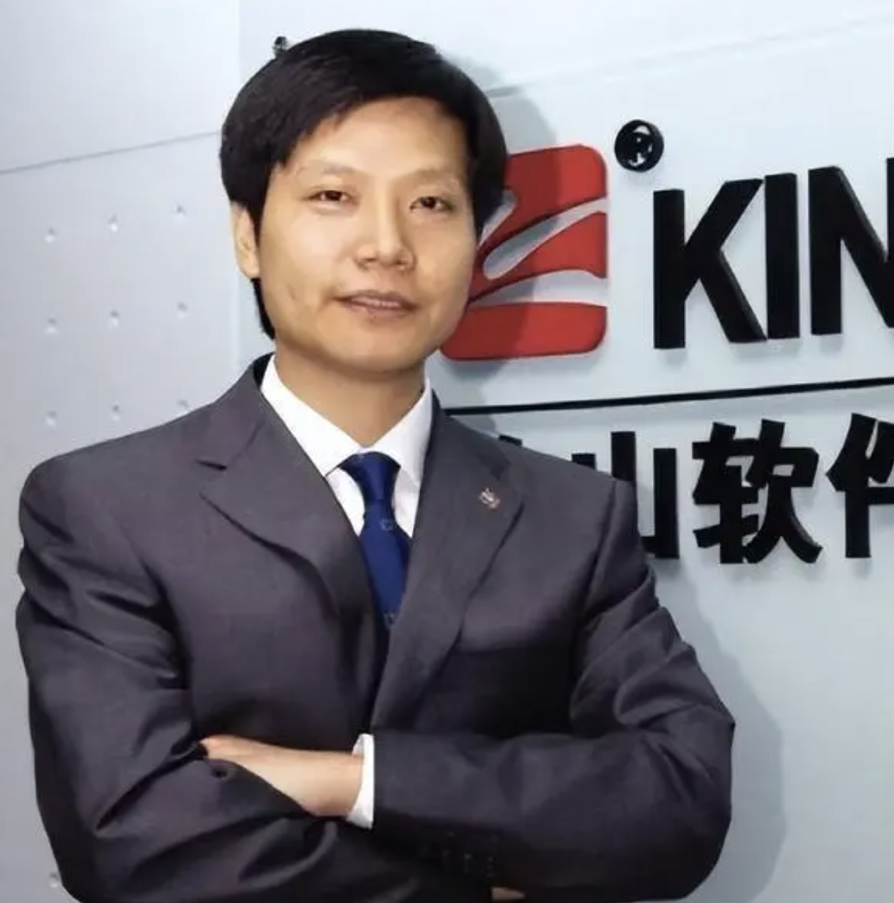
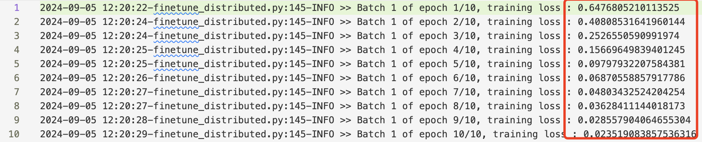

# Fine-tuning Qwen2-VL-2B

On August 29, 2024, the super star of the open-source big model community, Qwen team, released a VLM (Qwen2-VL), with 2B, 7B, and 72B versions. Overall, the Qwen2-VL 72B model has achieved optimal performance in most indicators, even surpassing closed-source models such as GPT-4o and Claude3.5-Sonnet, especially in document understanding. They have showcased many impressive cases on their blog, for details, please refer to https://qwenlm.github.io/zh/blog/qwen2-vl/. The Qwen2-VL model architecture diagram is very well drawn, and I have cited it separately below. 

   
    

Qwen2-VL is great, and many people believe they want to continue train or fine-tuning it on their own data, but Qwen team haven't provided a simple fine-tuning or continue pre-train code when I wrote this repo. 

Note: Qwen team provided a method for fine-tuning Qwen2-VL using the LLaMA-Factory approach. I tried it and found that LLaMA-Factory is a bit heavy, with many concepts, even a bit redundant. I personally prefer simple and transparent code, so I wrote a fine-tuning code script for Qwen2-VL, hoping to help anyone who like to write their own training loops.  

I have a WeChat subscription account "Backpropagation", where I occasionally write some technical articles, including this one ( https://mp.weixin.qq.com/s/mN9Pxpd2Wciw1-IAoFc08A ), welcome to follow.
 

### Quick Start for Fine-tuning or continue pre-train Qwen2-VL 2B Model
---

```bash
%git clone https://github.com/zhangfaen/finetune-Qwen2-VL
%cd finetune-Qwen2-VL
%conda create --name qwen2-VL python=3.10
%conda activate qwen2-VL
%pip install -r requirements.txt
```

I have provided two fine-tuning scripts, one for single GPU training and one for multi-GPU training. The purpose of this repo is to help get started with fine-tuning Qwen2-VL quickly, so I only prepared a very toy data, see train_data/data.json file. At the same time, the training code does not do any evaluation, it just simply prints the training loss. If you want to add an evaluation step during the training process, you can refer to the train_data/data.json file, prepare the data, and then modify finetune_distributed.py or finetune.py.

If you want to fine-tune the model with a single GPU card, you can run the following command:
```bash
./finetune.sh # Note that the CUDA_VISIBLE_DEVICES variable in this file should be set to the appropriate value
```   
If you want to fine-tune the model with multiple GPU cards, you can run the following command:
```bash
./finetune_distributed.sh # Note that the CUDA_VISIBLE_DEVICES variable in this file should be set to the appropriate value
```   

### Test the Fine-tuned Model

---
```bash
%python test_on_official_model.py # Test the official Qwen2-VL 2B model
%python test_on_trained_model_by_us.py # Test our fine-tuned or retrained Qwen2-VL 2B model
```   
Note: The test_on_trained_model_by_us.py file defines model_dir. If you have fine-tuned multiple models, you can modify this file to specify the path of your fine-tuned model.

In addition, if you do not have enough GPUs (GPU Poor) to try the code in this repo, you can download a model that I have fine-tuned:

```bash
%huggingface-cli download zhangfaen/Qwen2-VL-2B-checkpoint  --local-dir model_checkpoint/
%python test_on_trained_model_by_us.py # Note to modify the model_dir variable value in this file to "model_checkpoint/"
```

The above test_on_official_model.py and test_on_trained_model_by_us.py both describe the two pictures under test_data/.
Whether it is the official Qwen2-VL 2B model or our fine-tuned or retrained Qwen2-VL 2B model, both can describe these two pictures very well, but the description results are slightly different.

For example, the following picture:

   

The official Qwen2-VL 2B model describes the result as follows:
```
This picture shows a person wearing a gray suit and a blue tie, standing in front of a background with a "KING" logo. The logo on the background has Chinese and English text, showing the "KING" brand or company name. This person looks very formal and may be in a business or office environment.
```

Our fine-tuned Qwen2-VL 2B model describes the result as follows:

```
This picture shows a man in a formal suit. He is wearing a gray suit jacket and a blue tie, with his hands crossed in front of his chest, looking very confident and professional. The background is a white wall with a red and black logo that reads "KING". The overall atmosphere is very formal and professional.
```

Another picture:
   

The official Qwen2-VL 2B model describes the result as follows:
```
This picture shows the interface of a Chinese search engine, specifically the "Youdao" search engine. The top of the page shows the search box and search tips, with "beach" entered in the search box and the "English-Chinese" option selected. The search results list words and phrases related to "beach", including:  
 1. beach - beach, seaside; v. to pull (a boat) ashore; to run aground; (for anglers) to fish.   
 2. beaches - beaches, seafront (plural of beach)   
 3. beachhead - n. [military] beach
 ```
Our fine-tuned Qwen2-VL 2B model describes the result as follows:
```
This picture shows the interface of a Chinese search engine, specifically the "Youdao" search results page. The top of the page shows the "Youdao" logo and English name. There is a blue rectangular box in the middle of the page, which shows the translation and related vocabulary of the word "beach".
In the blue box, there are three related words: beach, beaches, and beachhead. Each word has a corresponding English explanation and usage description. For example, "beach" means beach, seaside; "beaches" means beaches, seafront (plural form of beach);  
 ```

Overall, the fine-tuned model seems to have not been greatly affected in performance. The following picture is a log file during the fine-tuning process.
   
It can be seen that the training loss is decreasing, indicating that the model has converged during the training process.


### Acknowledgement
---
This repo is built based on 
- https://huggingface.co/Qwen/Qwen2-VL-2B-Instruct/
- https://huggingface.co/zhangfaen/Qwen2-VL-2B-checkpoint/    

Many thanks to them for the great model/data/code!

