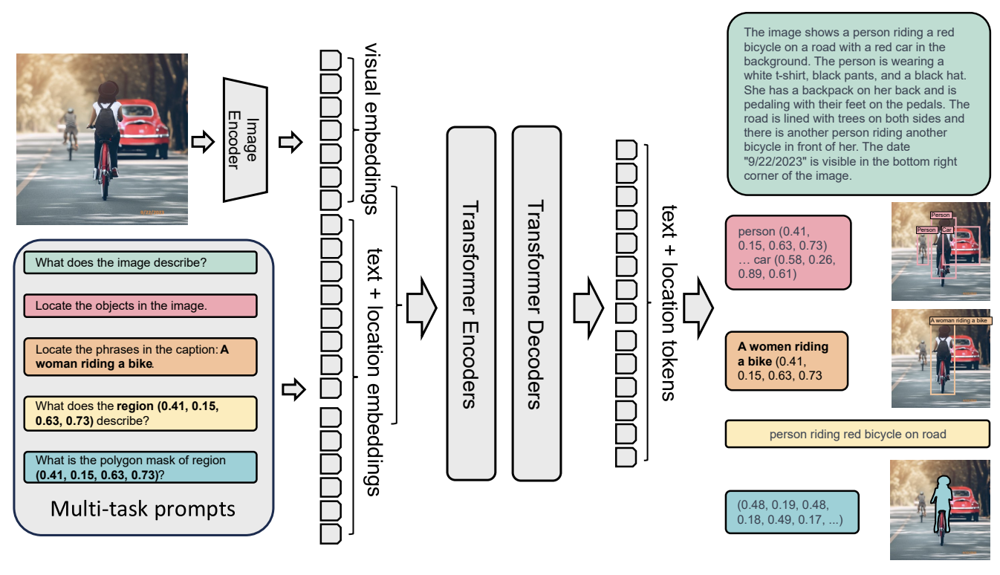

# Try to finetune Qwen2-VL for object detection
Qwen2-VL is a strong VLM.  You may heard that: Florence 2, released by Microsoft in June 2024, is a foundation vision-language model. This model is very attractive because of its small size (0.2B and 0.7B) and strong performance on a variety of computer vision and vision-language tasks. https://github.com/zhangfaen/finetune-Florence-2-large-ft  
  

It could be used for object detection, however Qwen2-VL haven't support object detection by outputting objects labels and bounding boxes coordinates. So I try to finetune Qwen2-VL for object detection for fun.

**Note**  This folder has immature code, it is just for fun. I will update it when I have time.

